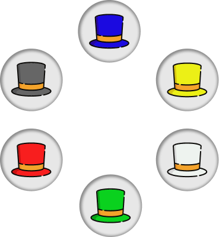
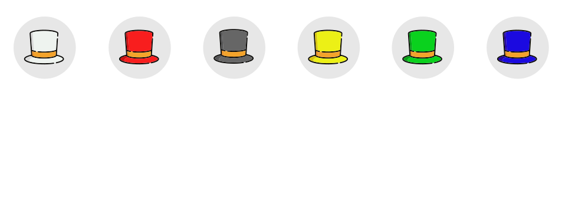

# SIX THINKING HATS

Nguyen Quang Son - 10/05/2024

---

## Introduction

Six Thinking Hats is a method for parallel thinking developed by Edward de Bono. It provides a structured approach for exploring different perspectives on a problem or situation.

---

## White Hat

- Focuses on facts, data, and information.
- Considers what information is available and what is needed.

---

## Red Hat

- Represents emotions, intuition, and gut feelings.
- Encourages expressing feelings without the need for justification.

---

## Black Hat

- Deals with caution, criticism, and potential risks.
- Identifies weaknesses, threats, and potential problems.

---

## Yellow Hat

- Emphasizes optimism, positivity, and benefits.
- Looks for opportunities, advantages, and potential solutions.

---

## Green Hat

- Stimulates creativity, brainstorming, and new ideas.
- Encourages generating alternatives and thinking outside the box.

---

## Blue Hat

- Serves as the facilitator or organizer of the thinking process.
- Manages the thinking process, sets agendas, and controls discussions.

---

# How to Use Six Thinking Hats

1. **Separate Thinking**: Use each hat separately to focus on one aspect at a time.
2. **Focus and Time**: Allocate specific time for each hat to ensure balanced exploration.
3. **Sequence**: Follow a structured sequence or adapt it based on the needs of the situation.
4. **Encourage Participation**: Ensure everyone participates in each thinking mode.
5. **Capture Ideas**: Document insights, ideas, and decisions generated during each hat session.

---

# Overall

---

# Example Application

Use **Six Thinking Hats** to perceive and evaluate this [video](https://duckduckgo.com).

---

- **White Hat**: Key concepts Jung proposed about introversion, extraversion, and ambiversion? Any evidence supports or challenges these concepts?
- **Red Hat**: How do you personally feel about the idea of introversion, extraversion, and ambiversion?
- **Black Hat**: Are there any logical inconsistencies or gaps in the theory?
  How might Jung's framework fail to adequately capture the complexity of human personality?
- **Yellow Hat**: How has Jung's framework contributed to our understanding of personality? Benefits for individuals and organizations?
- **Green Hat**: How might contemporary research or psychological frameworks expand upon Jung's ideas?
- **Blue Hat**: Manage the thinking process and guide the discussion. Ensure that each hat's perspective is considered thoroughly and fairly. Summarize key insights and conclusions drawn from the analysis.

---

# Conclusion

Six Thinking Hats offers a structured approach to problem-solving and decision-making by encouraging diverse perspectives and systematic exploration of ideas. By wearing different hats, individuals can enhance their creativity, critical thinking, and decision-making skills.
